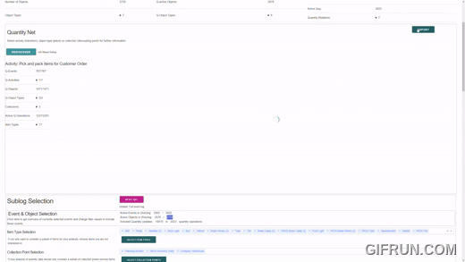

## Readme Still in Progress

# QRPM
This interactive Quantitative Process Mining-Tool (QRPM) allows for the basic analysis of quantity event logs (QELs) which extend the OCEL 2.0 standard.
Its functionalities encompass:
- the determination of the quantity state prior to every event as described in [1], 
- the discovery and visualisation of the corresponding quantity net (q-net) [1],
- functionalities for filtering the QEL and rediscovering the q-net based on the filtered log,
- basic processing and visualisations of the quantity data based on the (filtered) QEL, and
- functionalities for exporting the quantity data (csv), charts (png), and q-net (svg).
The demo data added to the repository (uses for the evaluation in [1]) was added to the repository to give the user an 
idea of the expected input format and the functionalities of the tool.

The following screencast shows the basic functionalities of QRPM:



[Full Screencast Video](https://youtu.be/1ipKGYq3LeE)

QRPM © 2024 by Nina Graves is licensed under CC BY 4.0. To view a copy of this license, visit http://creativecommons.org/licenses/by/4.0/

## Installation
The repository uses poetry for dependency management. If you do not have poetry installed, you can install it by running:
```pip install poetry```
Installation of the full tool has to occur in four steps:
1. Manually install PyGraphviz (needed for the visualisation of the underlying Q-net): https://gitlab.com/graphviz/graphviz/-/package_files/6164164/download
2. To install PyGraphviz in the poetry environment, you must follow the instructions on https://pygraphviz.github.io/documentation/stable/install.html
For Windows this means you must run:
```poetry run pip install --config-settings="--global-option=build_ext" `
              --config-settings="--global-option=-IC:\Program Files\Graphviz\include" `
              --config-settings="--global-option=-LC:\Program Files\Graphviz\lib" `
              pygraphviz```
3. Run ```poetry install``` again to synchronise the dependencies

## Functionality
QRPM is a tool for the analysis of quantity event logs (QELs) which extend the OCEL 2.0 standard [2]. 
All quantity-related functionalities (marked *qr*) only show if the uploaded event log also contains quantity-related information; 
log filtering and (re-)discovery also work with normal OCEL 2.0s. 
Immediately after uploading a valid event log, QRPM 
1. determines the quantity state prior to every event, 
2. shows some basic statistics about the log, and 
3. discovers and visualises the quantity 
net (q-net) as described in the paper. 

You can zoom into the q-net, click on nodes to get information on the process elements (activities, object types, 
collection points), and export the displayed q-net as svg.
Beneath the q-net, there is a section for QEL filtering -- the user can expand the "Event & Object Selection"-Section.
Below the sublog creation, you find two tabs for processing and exporting data on the quantity state (Tab 1) and the quantity operations (Tab 2).
Each of these tabs includes various visualisations and tables that can be used for an interactive analysis of the QEL.
All Figures can be downloaded as PNGs by clicking on the camera icon in the top right corner of the figure.

### Sublog Creation
The user can filter the QEL by selecting a subsets of events, objects, item types and collection points.
The selection of item types and collection points merely removes the corresponding quantity updates/quantity operations 
of the QEL but not the connected events.

By selecting a subset of events and/or objects the user removes the corresponding event to object relations from the QEL.
This means that if, for example, all objects of a type are removed, the corresponding events are only also removed if 
they are not connected to any other object still remaining in the log.
Similarly, if you filter for a subset of events, ALL objects associated with these events also remain in the log -- even 
if the subset of events you decide to keep is specified by a selection of a subset of objects.
QRPM offers the filtering of events based on the following criteria:
- time frame
- activity
- event attributes
- object types involved in the event
- events connected to object with specific attributes
- events with a specific number of objects of a particular object type
- events executed a specific number of times by the same object of a particular object type
- events with a specific total number of involved objects
- (*qr*) quantity active/inactive events
- (*qr*) events quantity active for a set of collection points
- (*qr*) events quantity active for a set of item types
- (*qr*) events executed during a specific quantity state

Objects can be filtered based on the following criteria:
- object types
- objects of a specific object type executing a specific activity
- objects of a specific object type executing a specific activity a specific number of times.

By applying multiple filters, the user can create a sublog that only contains the events and objects that meet all the specified criteria.
By clicking "Reset QEL" all filters are reset and the original QEL is restored.
Only quantity operations connected to the selected events, collection points and item types are considered in the quantity operations tab.

### Quantity Data Processing (*qr*)

 ---- coming soon ----

#### Quantity State

 ---- coming soon ----

#### Quantity Operations

 ---- coming soon ----

## References
[1] in review
[2] https://www.ocel-standard.org/
[3] in progress 


